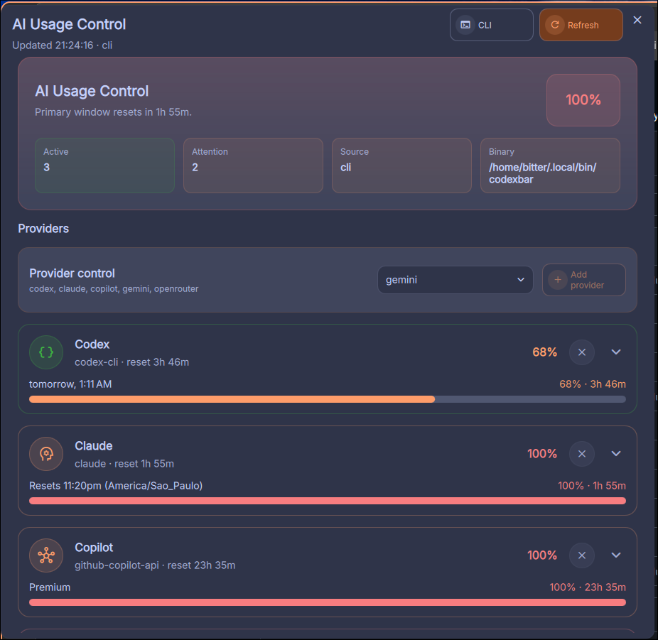

<div align="center">


[](https://github.com/bernardopg/AiOverviewControl/actions/workflows/ci.yml)
[](https://github.com/bernardopg/AiOverviewControl/releases)
[](../LICENSE)
[](https://crowdin.com/project/aioverviewcontrol)

**Widget autocontido para Dank Material Shell que monitora uso, limites, janelas de reset e saúde de providers de IA.**

[English](../README.md) · [Português do Brasil](README.pt-BR.md) · [Documentação](#-documentação) · [Abrir issue](https://github.com/bernardopg/AiOverviewControl/issues/new/choose)

</div>

---

## ✨ O Que Ele Faz

O AiOverviewControl adiciona um painel de telemetria ao Dank Material Shell (DMS). Ele acompanha múltiplos providers de IA, destaca na DankBar o provider mais perto do limite e abre um dashboard detalhado com cartões individuais de uso.

O plugin foi desenhado para continuar útil mesmo quando um provider falha: cada provider é coletado separadamente, então uma falha em Gemini, OpenRouter, Copilot ou Claude não esconde os providers que estão funcionando.



## 🚀 Destaques

- 📊 **Indicador compacto na DankBar** mostrando o provider mais perto do limite.
- 🧩 **Dashboard flutuante** com cartões, barras de progresso, janelas de reset e erros isolados.
- 🛠️ **Helpers locais autocontidos** para Copilot, Claude Code, fallbacks de Codex e providers compatíveis.
- ⚙️ **Controles visuais de provider** para adicionar ou remover providers sem editar JSON manualmente.
- 🌍 **Traduções via Crowdin** usando arquivos JSON em `i18n/`.
- 🔒 **Repositório organizado** com CI, code scanning, Dependabot, templates, discussions e política de segurança.

## 📦 Requisitos

- Dank Material Shell rodando sobre Quickshell.
- Ferramentas Linux: `bash`, `node`, `jq` e `curl`.
- Recomendado: `codexbar` em `PATH`, `~/.local/bin`, `/usr/local/bin` ou configurado nas opções do plugin.
- Opcional para Copilot: `gh auth login`, `COPILOT_GITHUB_TOKEN`, `GH_TOKEN` ou `GITHUB_TOKEN`.
- Opcional para detalhes de Claude: `claude`, `~/.claude/.credentials.json` e logs locais em `~/.claude/projects`.

## ⚡ Instalação Rápida

Copie o plugin para a pasta de plugins do DMS, torne os helpers executáveis e reinicie o DMS:

```bash
cd /caminho/onde/baixou/AiOverviewControl
mkdir -p ~/.config/DankMaterialShell/plugins/AiOverviewControl
cp -a AiOverviewControlWidget.qml AiOverviewControlSettings.qml AiOverviewControlI18n.qml \
  plugin.json qmldir providers README.md CHANGELOG.md LICENSE docs i18n screenshot.png \
  ~/.config/DankMaterialShell/plugins/AiOverviewControl/
chmod +x ~/.config/DankMaterialShell/plugins/AiOverviewControl/providers/get-*
dms restart
```

Depois abra as configurações do DMS, habilite **AiOverviewControl** e adicione o widget a uma seção da DankBar.

Guia completo: [installation.md](./installation.md)

## ⚙️ Configuração Recomendada

| Opção                | Valor recomendado      | Motivo                                                    |
| -------------------- | ---------------------- | --------------------------------------------------------- |
| Provider Set         | `codex,claude,copilot` | Boa cobertura padrão para uso local de assistentes de IA. |
| Source Mode          | `cli`                  | Usa CLIs locais e helpers nativos primeiro.               |
| Show Provider Errors | `true`                 | Facilita setup e diagnóstico de providers.                |
| Refresh Interval     | `120000` ou `300000`   | Mantém a telemetria atualizada sem polling excessivo.     |

Referência de configuração: [configuration.md](./configuration.md)

## 🤖 Providers

O AiOverviewControl reconhece estes IDs de provider:

```text
codex, claude, copilot, gemini, openrouter, 9router, deepseek, kimi, minimax, glm, mistral,
ollama, nvidia, cloudflare, vertexai, byteplus, qwen, together, groq, cohere, replicate,
fireworks, ai21, perplexity, cursor, kilo, kiro, warp, amp, cline, opencode
```

O suporte real depende das credenciais locais, APIs disponíveis, scripts auxiliares incluídos no plugin e suporte opcional via `codexbar`.

| Provider | Caminho de coleta | Observações |
| -------- | ----------------- | ----------- |
| `codex` | fallback via `codexbar` | Lê uso de providers compatíveis com CodexBar local. |
| `claude` | `providers/get-claude-usage` | Inclui analytics de Claude Code, janelas, tokens, sessões e custo estimado. |
| `copilot` | `providers/get-copilot-usage` | Usa autenticação do GitHub via `gh` ou variáveis de ambiente. |
| `deepseek`, `kimi`, `minimax`, `glm` | helpers nativos | APIs de saldo em CNY ou cota de tokens. |
| `openrouter`, `9router`, `cloudflare` | helpers nativos | Créditos ou cota de neurons. |
| `together`, `cohere`, `fireworks`, `ai21` | helpers nativos | Saldo de crédito ou trial_credits. |
| `groq`, `replicate` | helpers nativos | Validação de chave + note-card (sem API de cota pública). |
| `mistral`, `nvidia`, `byteplus`, `qwen`, `vertexai` | helpers nativos | Validação de chave/auth + note-card (sem endpoint de cota). |
| `ollama` | helper nativo | Lista de modelos locais via `/api/tags`. |
| `gemini`, `perplexity`, `cursor`, `kilo`, `kiro`, `warp`, `amp`, `cline`, `opencode` | helpers nativos ou fallback via `codexbar` | Cobertura varia por API do provider e credenciais locais. |

Matriz completa: [providers.md](./providers.md)

## 🧪 Validação Local

Na raiz do repositório, use estes comandos para separar problema de ambiente, autenticação e UI:

```bash
jq . plugin.json
bash -n providers/get-*
codexbar usage --format json --provider codex --source cli
codexbar usage --format json --provider claude --source cli
./providers/get-provider-usage "$(command -v codexbar)" "codex,claude,copilot" "cli" ./providers/get-copilot-usage
./providers/get-copilot-usage
./providers/get-claude-usage
qmllint AiOverviewControlWidget.qml AiOverviewControlSettings.qml AiOverviewControlI18n.qml
```

Se um provider funciona no terminal, mas não aparece no painel, comece por [troubleshooting.md](./troubleshooting.md).

## 🗂️ Estrutura Do Projeto

| Caminho                                                    | Função                                                                            |
| ---------------------------------------------------------- | --------------------------------------------------------------------------------- |
| `AiOverviewControlWidget.qml`                              | Indicador da DankBar, dashboard, coleta e renderização.                           |
| `AiOverviewControlSettings.qml`                            | Interface de configurações no DMS.                                                |
| `AiOverviewControlI18n.qml`                                | Loader e lookup de traduções.                                                     |
| `providers/get-provider-usage`                             | Backend unificado e dispatcher de fallbacks.                                      |
| `providers/get-provider-wrapper` / `providers/get-*-usage` | Entrypoints por provider que delegam ao backend compartilhado.                    |
| `providers/get-copilot-usage`                              | Ponte para uso do GitHub Copilot.                                                 |
| `providers/get-claude-usage`                               | Analytics local de Claude Code e ponte de uso.                                    |
| `i18n/`                                                    | Arquivos JSON de idioma gerenciados com Crowdin.                                  |
| `.github/`                                                 | CI, code scanning padrão, Dependabot, funding, templates e arquivos comunitários. |

Visão técnica: [architecture.md](./architecture.md)

## 📚 Documentação

- 🇺🇸 README principal: [../README.md](../README.md)
- 🇧🇷 README em português: [README.pt-BR.md](./README.pt-BR.md)
- 🧭 Instalação: [installation.md](./installation.md)
- ⚙️ Configuração: [configuration.md](./configuration.md)
- 🤖 Providers: [providers.md](./providers.md)
- 🌍 Crowdin e i18n: [i18n-crowdin.md](./i18n-crowdin.md)
- 🧱 Arquitetura: [architecture.md](./architecture.md)
- 🩺 Troubleshooting: [troubleshooting.md](./troubleshooting.md)

## 🤝 Contribuindo

Issues, pedidos de provider, traduções e pull requests são bem-vindos.

- Use os [templates de issue](https://github.com/bernardopg/AiOverviewControl/issues/new/choose) para bugs, features e providers.
- Use [discussions](https://github.com/bernardopg/AiOverviewControl/discussions) para suporte e perguntas gerais.
- Reporte vulnerabilidades pelo fluxo de segurança do repositório e siga [../.github/SECURITY.md](../.github/SECURITY.md).
- Para traduções, veja [i18n-crowdin.md](./i18n-crowdin.md).

<div align="center">

## 💜 Apoio

Se o AiOverviewControl ajuda no seu setup do DMS, você pode apoiar a manutenção pelo GitHub Sponsors:

[](https://github.com/sponsors/bernardopg)

## 📄 Licença

Distribuído nos termos de [LICENSE](../LICENSE).


