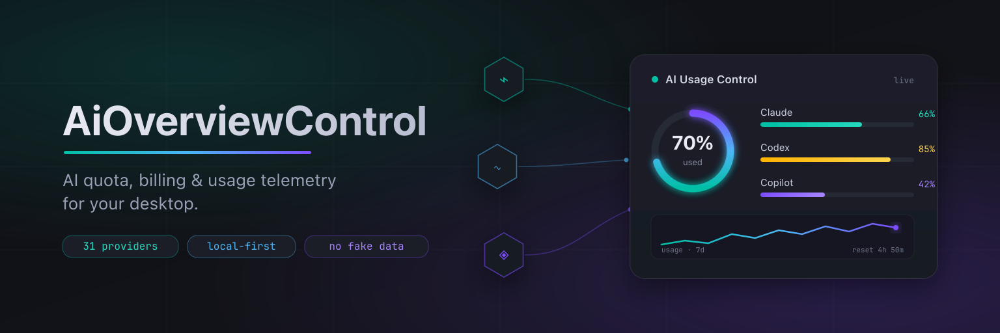
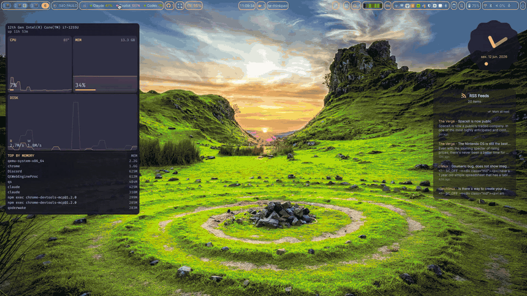
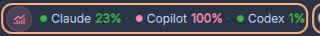
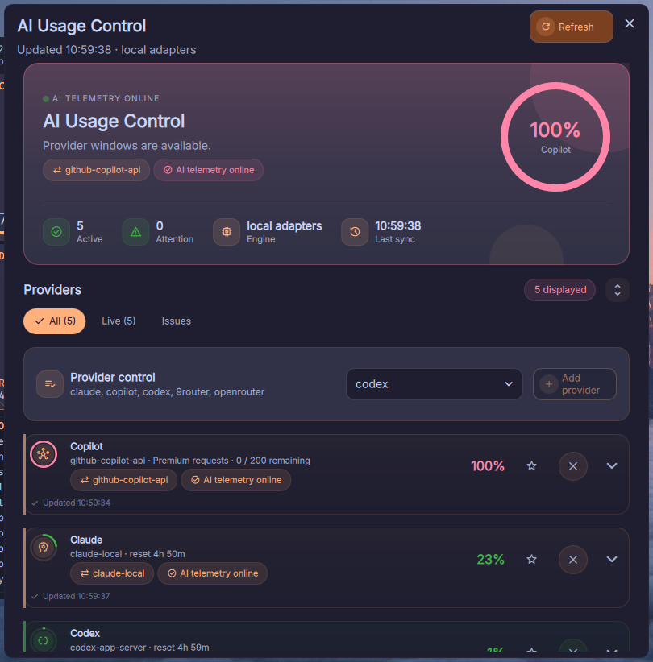
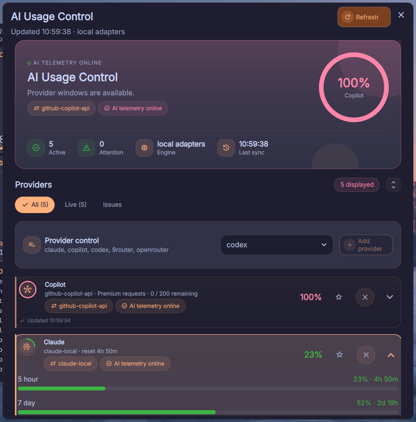
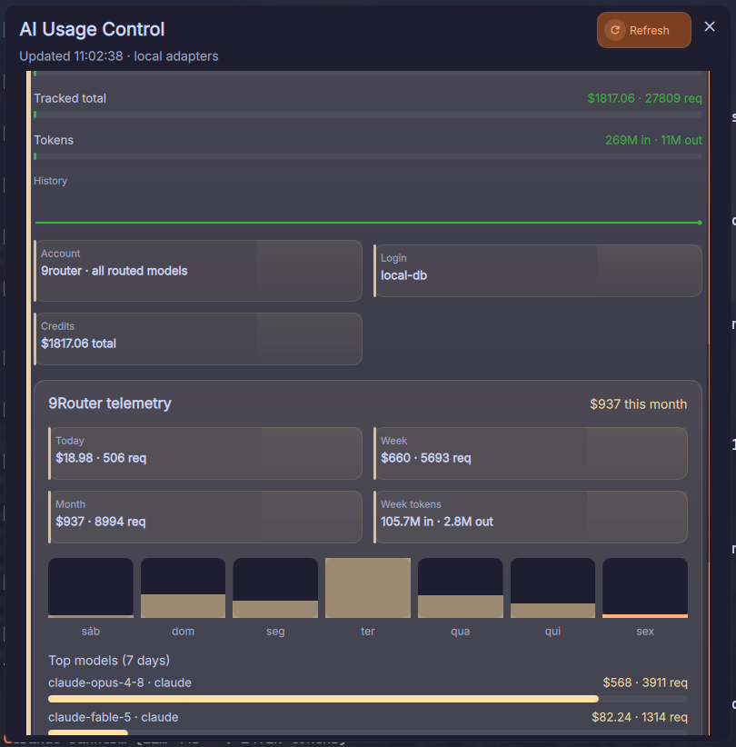

<div align="center">



# AiOverviewControl

**Todas as suas cotas de IA. Um dashboard. Zero achismo.**

Widget autocontido do [DankMaterialShell](https://github.com/AvengeMedia/DankMaterialShell) para cotas,
billing, autenticação e telemetria local de uso de IA — direto na sua DankBar.

[](https://github.com/bernardopg/AiOverviewControl/actions/workflows/ci.yml)
[](https://github.com/bernardopg/AiOverviewControl/releases/latest)
[](../LICENSE)
[](./providers.md)
[](./i18n-crowdin.md)

[Instalação](#instalação) · [Screenshots](#screenshots) · [Provedores](./providers.md) ·
[Configuração](./configuration.md) · [Changelog](../CHANGELOG.md) ·
[English](../README.md)

</div>

---

## Veja em ação



> 🎬 Prefere mais qualidade? Assista ao [demo em MP4](./assets/demo.mp4).

A pílula fica na DankBar e mostra o uso ao vivo:



## Por que AiOverviewControl?

Você paga por Claude, Codex, Copilot, OpenRouter — e cada um esconde a cota em
um dashboard, CLI ou API diferente. O AiOverviewControl coleta cada provedor
**de forma independente e local**, normaliza o resultado e renderiza uma visão
única e honesta, sem nenhum serviço externo de agregação.

**Honesto** é a palavra-chave: ele reporta dados medidos quando existe uma
fonte suportada e rotula claramente provedores apenas-autenticação ou
informativos quando não existe. Sem scraping de dashboards. Sem percentuais
inventados. Nunca.

## Destaques

| | |
| --- | --- |
| 📊 **Dashboard unificado** | 33 provedores de IA e ferramentas de desenvolvimento em um só lugar. |
| 🛰️ **Visão geral da frota** | Rollup cross-provider no hero — carga média só de cotas mensuráveis, provedor mais quente, quantos estão perto do limite e o próximo reset. |
| ⏱️ **Janelas oficiais do Codex** | Janelas de rate-limit direto do `codex app-server`. |
| 🤖 **Analytics profundo do Claude** | Cota mais analytics local de tokens, sessões, modelos, projetos e custo. |
| 🐙 **Cotas do Copilot** | Snapshots de Premium requests, Chat e Completions. |
| 🗂️ **Cartões ricos** | Janelas de uso, horários de reset, identidade, créditos, sparklines, tendências e links para o console. |
| 🛡️ **Falhas isoladas** | Um timeout ou credencial inválida nunca esconde provedores saudáveis. |
| 🎛️ **Layout flexível** | Densidade compacta/confortável, filtros por status, provedores fixados e pílula `auto`/`custom`/`top`. |
| 🔔 **Notificações de cota** | Alertas de desktop com limiares globais e por provedor, disparados uma vez por janela de cota. |
| 🌍 **5 idiomas de UI** | English, Português (BR), 简体中文, Español e Deutsch. |
| 🔒 **Privacidade em primeiro lugar** | Adaptadores locais, nenhuma chamada paga só para testar chave, segredos nunca exibidos. |

## Screenshots

| Visão geral do dashboard | Cartão de provedor expandido |
| --- | --- |
|  |  |

<details>
<summary><b>📈 Telemetria local detalhada (exemplo do 9Router)</b></summary>
<br>

Seções de telemetria por provedor incluem gráficos diários de custo, totais de
hoje/semana/mês, contadores de tokens in/out, top modelos e detalhamento por
provedor roteado — tudo lido de dados locais pertencentes ao provedor.



</details>

## Modelo de cobertura

Os cartões usam um de quatro níveis honestos de cobertura:

| Cobertura | Significado |
| --- | --- |
| **Cota ou saldo** | Retorna limites, uso, créditos ou dados de billing. |
| **Analytics local** | Lê arquivos ou bancos de dados pertencentes ao provedor. |
| **Autenticação** | Verifica credenciais sem dados estáveis de cota. |
| **Informativo** | Aponta para o uso oficial quando não existe API somente leitura. |

Integrações medidas notáveis:

| Provedor | Fonte de dados |
| --- | --- |
| Codex | Métodos oficiais de conta e rate-limit do `codex app-server`. |
| Claude Code | Cota OAuth mais analytics local de `~/.claude/projects`. |
| GitHub Copilot | Snapshot autenticado de cota GitHub/Copilot. |
| 9Router | Dados locais de uso em SQLite ou JSON, incluindo telemetria por modelo roteado. |
| OpenRouter | Limites de chave, gasto, saldo e atividade de modelos em 30 dias. |
| DeepSeek, Kimi, Together | APIs de saldo ou crédito do provedor. |
| Ollama | Modelos instalados e em execução via `/api/tags` e `/api/ps`. |
| Cloudflare | Verificação de token e analytics opcional do Workers AI via GraphQL. |
| Z.ai, GLM | `/api/monitor/usage/quota/limit` — uso real por janela, resets e plano da assinatura. |

A matriz completa, credenciais e referências upstream estão documentadas em
[Provedores](./providers.md) e
[Verificação de provedores](./provider-verification.md).

## Requisitos

- DankMaterialShell rodando sobre Quickshell.
- `bash`, `jq` e `curl`.
- CLIs ou credenciais específicas apenas para os provedores habilitados.

Linha de base recomendada para o conjunto padrão de provedores:

```bash
command -v bash jq curl codex claude gh
codex login
claude auth status
gh auth status
```

## Instalação

### Arquivo de release

Baixe o `.tar.gz` ou `.zip` da
[release mais recente](https://github.com/bernardopg/AiOverviewControl/releases/latest),
extraia como `AiOverviewControl` e coloque no diretório de plugins do DMS:

```text
~/.config/DankMaterialShell/plugins/AiOverviewControl
```

Depois restaure as permissões de execução e reinicie o DMS:

```bash
chmod +x ~/.config/DankMaterialShell/plugins/AiOverviewControl/providers/get-*
dms restart
```

### Clone via Git

```bash
git clone https://github.com/bernardopg/AiOverviewControl.git \
  ~/.config/DankMaterialShell/plugins/AiOverviewControl
chmod +x ~/.config/DankMaterialShell/plugins/AiOverviewControl/providers/get-*
dms restart
```

Ative **AiOverviewControl** nas configurações do DMS e adicione-o a uma seção
da DankBar. Orientações detalhadas de instalação e upgrade estão em
[docs/installation.md](./installation.md).

## Configuração

As configurações são armazenadas pelo DMS e sobrevivem a upgrades do plugin.

| Configuração | Valores | Padrão |
| --- | --- | --- |
| Idioma | `auto`, `en_US`, `pt_BR`, `zh_CN`, `es_ES`, `de_DE` | `auto` |
| Densidade do dashboard | `comfortable`, `compact` | `comfortable` |
| Modo da pílula | `auto`, `custom`, `top` | `auto` |
| Intervalo de atualização | 1, 2, 5, 15 ou 30 minutos | 2 minutos |
| Mostrar erros de provedor | habilitado ou desabilitado | habilitado |
| Detalhamento de projetos do Claude | habilitado ou desabilitado | habilitado |
| Notificações de cota | habilitado ou desabilitado | habilitado |
| Limiar global de notificação | 75%, 85% ou 95% | 85% |
| Limiares por provedor | pares `provedor:percentual` separados por vírgula (ex.: `claude:90,codex:75`) | vazio |
| Retenção de histórico | 500, 2.000 ou 10.000 snapshots | 2.000 |

A seleção padrão de provedores é:

```text
codex,claude,copilot
```

Provedores com API leem credenciais do ambiente do processo do DMS. Um export
disponível apenas em shell interativo pode não chegar a uma sessão gráfica do
DMS. Veja [Configuração](./configuration.md) para a matriz de variáveis de
ambiente e o comportamento do health-check.

## Comportamento do dashboard

- Cartões são ordenados com fixados primeiro, depois por maior uso mensurável,
  com provedores em falha por último.
- Cartões suportam foco por teclado, além de Enter/Espaço (expandir), Delete
  (remover), P (fixar) e R (tentar novamente).
- Dados ficam obsoletos após o dobro do intervalo de atualização configurado.
- Cartões em falha expõem uma ação de retry específica do provedor.
- Cartões expandidos mostram janelas disponíveis, créditos, fonte, identidade e
  horário de atualização, sem inventar campos indisponíveis.
- Snapshots de uso são armazenados localmente em
  `~/.cache/AiOverviewControl/usage-history.jsonl` e podados conforme a
  retenção configurada.
- O analytics do Claude roda separadamente, para que falhas de histórico local
  ou de OAuth não bloqueiem a coleta principal.

## Privacidade e resiliência

- Credenciais são lidas de CLIs dos provedores, dados locais pertencentes ao
  provedor ou variáveis de ambiente; a UI nunca exibe valores secretos.
- O plugin não faz scraping de dashboards web autenticados.
- Não chama endpoints pagos de inferência apenas para testar uma chave.
- Arquivos temporários são isolados por execução e removidos ao fim da coleta.
- Erros de provedor retornam como dados estruturados em vez de encerrar todo o
  refresh.
- Cartões informativos usam texto explícito e links oficiais em vez de
  percentuais sintéticos.

## Validação

<details>
<summary>Execute as mesmas verificações principais usadas pelo CI</summary>
<br>

```bash
jq -e . plugin.json >/dev/null
for file in i18n/*.json; do jq -e . "$file" >/dev/null; done
bash -n providers/get-*
shellcheck providers/get-*
qmllint \
  AiOverviewControlWidget.qml \
  AiOverviewControlSettings.qml \
  AiOverviewControlI18n.qml
./providers/get-provider-health "codex,claude,copilot" | jq .
./providers/get-provider-usage \
  "codex,claude,copilot" \
  ./providers/get-copilot-usage | jq .
./providers/get-usage-history | jq .
```

O GitHub Actions também valida sintaxe dos workflows, paridade de chaves de
locale, permissões dos scripts de provedor, contratos de integração,
configuração do Crowdin e empacotamento de release.

</details>

## Arquitetura

```text
AiOverviewControlWidget.qml       Orquestração de runtime e dashboard
AiOverviewControlSettings.qml     Configurações, seleção de provedores e UI de saúde
AiOverviewControlI18n.qml         Carregamento de locales e interpolação
providers/get-provider-usage      Dispatcher multi-provedor e escritor de histórico
providers/get-provider-health     Verificações locais de pré-requisitos
providers/get-codex-usage         Ponte do protocolo codex app-server
providers/get-claude-usage        Ponte de cota e analytics local do Claude
providers/get-copilot-usage       Ponte de cota do GitHub Copilot
providers/get-*-usage             Entrypoints canônicos de provedor único
```

Veja [Arquitetura](./architecture.md) para o fluxo de runtime e o contrato
normalizado de provedores.

## Documentação

| Tópico | Link |
| --- | --- |
| Instalação e upgrades | [installation.md](./installation.md) |
| Configuração e credenciais | [configuration.md](./configuration.md) |
| Matriz de cobertura de provedores | [providers.md](./providers.md) |
| Política de verificação de provedores | [provider-verification.md](./provider-verification.md) |
| Arquitetura e contrato de adaptadores | [architecture.md](./architecture.md) |
| Solução de problemas | [troubleshooting.md](./troubleshooting.md) |
| Internacionalização e Crowdin | [i18n-crowdin.md](./i18n-crowdin.md) |
| Checklist de release | [release-checklist.md](./release-checklist.md) |
| Changelog | [CHANGELOG.md](../CHANGELOG.md) |

---

<div align="center">

Distribuído sob a [Licença MIT](../LICENSE).

Feito com ❤️ para a comunidade [DankMaterialShell](https://github.com/AvengeMedia/DankMaterialShell).

</div>
